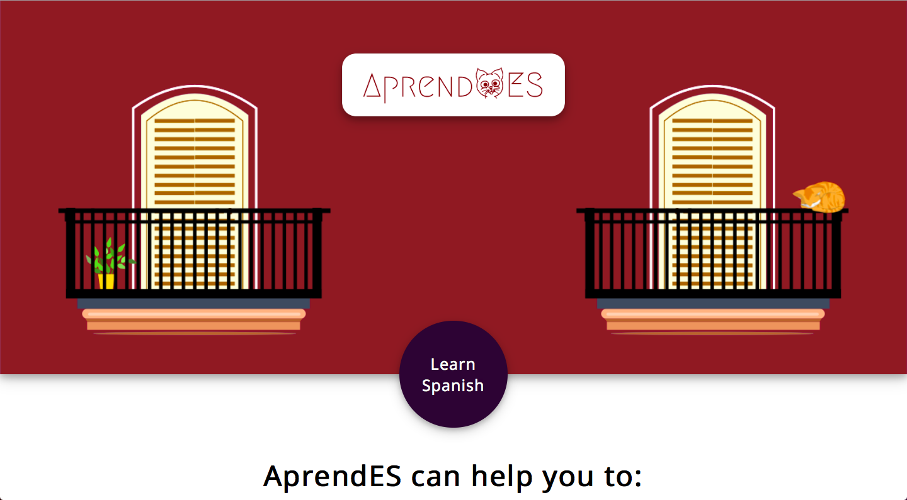

# aprendES

aprendES is a web application for learning Spanish online. It’s work-in-progress and it’s meant to combine my development skills with the teaching approaches that I found to work well. It has several types of exercises and a design, both of which I came up with by myself.


[Demo version](https://hopeful-kirch-e17f2e.netlify.com)
